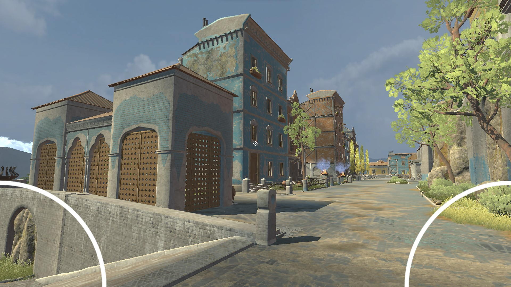

# UnityMultiplayer3D

It is a Unity Multiplayer Game Controller Demo created during my job in the company.

It is very fundamental and does not have many functionalities.

It could act as a tutorial of Unity for beginners.

This game is discontinued, so feel free to fork it. :)

To run the game, go to Assert > Scences > Dashboard.unity
